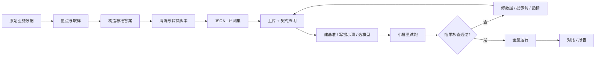

# 评测数据准备与评测任务指南

> 本文档回答两个问题：**拿到一份原始业务数据后，如何把它变成平台可评测的数据；以及开始评测任务前，要做哪些准备工作。**
> 配套文档：[USAGE.md](../USAGE.md)（完整工作流与 API）、[TESTING_GUIDE.md](../TESTING_GUIDE.md)（测试指南）。

---

## 1. 总体流程



**核心原则：所有处理的终点，是把业务问题翻译成“输入 → 标准答案 → 判定方式”三元组。**

---

## 2. 阶段一：从原始数据到评测数据

### 2.1 先定义评测任务，再碰数据

动手处理数据前，先回答三个问题：

1. **业务要判断什么？**（客服首响质量 / 工单分类准确率 / 摘要可用性 / 代码生成正确性……）
2. **一条评测样例的单位是什么？**（一次提问 / 一个工单 / 一段文档 / 一整场会话）
3. **“答对”怎么判定？**（与标准答案精确一致 / 语义等价 / 按维度打分）

这三个答案决定数据怎么切、标准答案取什么、基准和指标怎么选。

### 2.2 原始数据盘点与形态分类

查看四件事：字段、格式、条数、**有没有现成的“答案”**（人工回复、质检结论、业务标签、最终处理结果都算）。

| 形态 | 例子 | 主要处理工作 |
|---|---|---|
| 表格型 | 一行一条工单 + 处理结论 | 字段映射，成本最低 |
| 对话型 | 客服会话、聊天记录 | 按业务规则切片成问答对 |
| 文档型 | 知识库、报告 | 没有答案，需要造题 |
| 日志型 | 模型调用日志 | 过滤、还原上下文，规则差异大 |

### 2.3 取样

不要全量灌入。按业务场景分层抽样 **300~1000 条**：覆盖高频问题、低频但重要的场景、容易答错的边界 case。评测集质量比数量重要。

### 2.4 构造标准答案

| 原始数据情况 | 做法 |
|---|---|
| 已有答案（人工回复 / 标签 / 结论） | 直接抽取为标准答案 |
| 没有答案 | 人工标注，或“模型生成初稿 + 人工抽检修正” |
| 一题多答案 / 等价说法 | 不改数据，上传时用 `answer_policy`（aliases / multi_answer）声明 |
| 开放长文本（摘要 / 方案） | 用 `f1_token`、`llm_judge` 或 `llm_judge_rubric` 这类宽容指标 |

> ⚠️ 没有标准答案的行可以导入，但评测时**无法评分，记为 0 分**。造答案是唯一没有捷径的环节。

### 2.5 清洗与转换

平台已自动兼容：UTF-8 / GBK / UTF-16 编码、答案字段名大小写、答案前缀（`答案：4`）、空格、单位、标点。

需要你手动处理的部分：

- 去重、去空行、修正明显脏值；
- 字段改名，使**输入字段名与提示词变量一致**（提示词写 `{question}`，数据就必须有 `question`）；
- 会话日志按评测单位切片（取首轮问答 / 保留完整上下文）；
- 嵌套结构压成一行对象，或改用 `structured_chat` / `examples` 表达；
- 敏感字段（手机号、订单号）标记为 `sensitive_fields`。

### 2.6 转换脚本

建议写一个一次性转换脚本，职责固定为：**读入 → 清洗 → 按业务规则切样例 → 字段对齐 → 输出 JSONL + 统计 + contract 建议**。

脚本不是万能的：通用外壳（读文件、编码、去重、写 JSONL）可复用，但“哪列是输入、谁当答案、怎么切片”是业务规则，必须按数据形态定制。**遇到新数据先判断形态，同形态复用脚本，新形态重写切片规则。**

### 2.7 平台输入格式规范（JSONL 标准形态）

**基本约束：每行一个 JSON 对象；标准答案用固定键名；其余字段为输入。**

标准答案键（大小写不敏感）：`expected`、`answer`、`label`、`output`、`target`、`ground_truth`。其中 `expected` 可以是字符串、列表或嵌套对象。

**QA / 短答案**
```jsonl
{"question": "2+2等于几？", "answer": "4"}
{"question": "中国的首都是哪里？", "answer": "北京"}
```

**分类**
```jsonl
{"text": "这家店服务态度很好", "label": "正面"}
```

**代码生成**
```jsonl
{"prompt": "用Python写一个斐波那契函数", "answer": "def fibonacci"}
```

**摘要 / 生成**
```jsonl
{"article": "……全文……", "answer": "城市发布人才引进政策，给予最高200万元安家补贴……"}
```

**多答案 + 别名**（配合 `answer_policy`）
```jsonl
{"question": "1+1等于几？", "answer": ["2", "二"]}
```

**嵌套标准答案**
```jsonl
{"question": "首都？", "expected": {"answer": "北京", "reasoning": "它是政治中心"}}
```

**多轮对话**（配合 `structured_chat: true`）
```jsonl
{"messages": [
   {"role": "system", "content": "你是客服助手"},
   {"role": "user", "content": "我要退货"},
   {"role": "assistant", "content": "请提供订单号"}
 ],
 "answer": "您好，请提供订单号"}
```

**few-shot 示例**
```jsonl
{"examples": [{"问题": "1+1？", "答案": "2"}, {"问题": "2+2？", "答案": "4"}],
 "question": "3+3？", "answer": "6"}
```

> ⚠️ CSV / TSV / XLSX 只适合扁平结构（一列输入 + 一列答案）。多答案列表、messages、examples 等嵌套结构请用 JSONL。

---

## 3. 阶段二：上传数据集与契约声明

### 3.1 支持的格式与硬性限制

| 项目 | 约束 |
|---|---|
| 格式 | JSONL（推荐）、JSON（数组或 `{"data":[...]}`）、CSV、TSV、XLSX（第一个 sheet + 表头） |
| 编码 | UTF-8（含 BOM）、GBK/GB2312、UTF-16 |
| 文件大小 | ≤ 50 MB（`max_upload_bytes`） |
| 行数 | ≤ 100,000（`max_dataset_rows`） |
| 空数据集 | 拒绝（0 行不允许） |
| 名称 | 项目内唯一 |
| 内容校验 | 格式与文件头一致（如 JSONL 首行必须 `{`） |

### 3.2 上传参数与字段映射

上传时可通过表单参数声明契约；不声明时平台自动推断（自动识别答案键，其余列为输入）。

| 参数 | 作用 |
|---|---|
| `format` | 显式指定格式，缺省按扩展名推断 |
| `task_type` | 任务类型（qa / classification / coding / generation / agent），默认 qa |
| `input_fields` | 指定哪些字段是输入 |
| `expected_fields` | 指定哪些字段是标准答案 |
| `metadata_fields` | 指定元数据字段（存入 `_metadata`，不参与提示词渲染） |
| `required_fields` | 必填字段，缺失时行级报错 |
| `field_types` | 字段类型校验：string / number / integer / boolean / array / object / json |
| `answer_policy` | 答案匹配策略，见 3.3 |
| `contract` | 整体契约 JSON（可包含以上全部配置） |
| `sensitive_fields` | 敏感字段列表，展示时脱敏并留审计 |
| `structured_chat` | 开启多轮消息 / few-shot 结构 |

### 3.3 answer_policy 详解

```json
{
  "aliases": ["Beijing", "北京城"],
  "accepted_answers": ["2", "二"],
  "multi_answer": "all",
  "partial_credit": true,
  "strip_units": true
}
```

| 配置 | 说明 |
|---|---|
| `aliases` / `accepted_answers` / `valid_answers` | 标准答案的等价写法，命中任一即得分 |
| `multi_answer: "all"` | 要求全部答案都出现（默认全有或全无） |
| `multi_answer: "set"` | 要求答案集合完全一致 |
| `partial_credit: true` | 多答案命中部分时按比例给分（0.5 分这种），默认关闭 |
| `strip_units` | 匹配前剥离单位，默认 true |

### 3.4 structured_chat 多轮对话

- 行内 `messages` 必须是 `{"role": "system|user|assistant", "content": "字符串"}` 的列表；
- 行内 `examples` 是 few-shot 示例列表（字符串或对象）；
- `messages` / `examples` 之外的字段仍按普通输入字段渲染到最终一轮；
- 违反上述结构会得到行级导入错误。

### 3.5 导入校验与错误处理

上传后平台返回**行级校验报告**：缺必填字段、字段类型不匹配、多轮结构非法等都会精确到行。按报告修正后重新上传即可，一般一两轮收敛。

### 3.6 版本化

每次导入生成**不可变的版本快照**；实验创建时锁定数据集版本。修改数据不影响历史实验结果，后续可追溯“这版结论是哪份数据得出的”。

---

## 4. 阶段三：评测任务前的准备工作

### 4.1 创建项目

所有资源（数据集、基准、提示词、模型、实验）按项目隔离。先建项目，再往里放资源。

### 4.2 注册模型

在模型中心注册要评测的模型：模型 ID、Provider（qiniu / openrouter / mock）、定价（用于成本统计）、能力标签与上下文长度。不配 API Key 时自动使用 Mock Provider 离线演示。

### 4.3 创建基准（类型 + 指标）

| 基准类型 | 默认指标 | 适用场景 |
|---|---|---|
| qa | exact_match_ci | 短答案精确比对（归一化后） |
| classification | exact_match_ci | 分类标签 |
| coding | contains | 输出包含关键片段 |
| generation | f1_token | 摘要等长文本的 token 重叠 |
| agent | contains | 单轮输出包含预期结果 |

**全部可用指标**：`exact_match`、`exact_match_ci`、`contains`、`f1_token`、`numeric_match`、`fuzzy_match`、`fuzzy_match_ci`、`llm_judge`、`llm_judge_rubric`。

**指标选择原则**：

- 标准答案唯一的短回答 → `exact_match_ci`；
- 开放长文本 / 语义等价 → `llm_judge`（二元判定）或 `llm_judge_rubric`（维度打分）；
- 数字答案 → `numeric_match`（带容差）；
- 多答案任务 → 配合 `answer_policy` 使用，需要部分得分时开 `partial_credit`。

**llm_judge_rubric 配置示例**（维度化评分，输出 0~1 连续分）：

```json
{
  "dimensions": [
    {"name": "correctness", "description": "答案是否正确", "weight": 2},
    {"name": "completeness", "description": "是否覆盖关键点", "weight": 1},
    {"name": "coherence", "description": "表达是否通顺", "weight": 1}
  ],
  "scale": 5,
  "rationale": true
}
```

不传 `dimensions` 时按基准类型使用内置维度（qa 用正确性+完整性，generation 加连贯性，coding 加质量，agent 用目标达成+完整性）。

### 4.4 编写提示词

- 模板变量用 `{变量名}`，**必须与数据集输入字段一一对应**（支持嵌套路径 `{user.name}`、`{items.0}`）；
- 短答案任务让模型**只输出答案本身**，避免多余解释；若提示词强制“答案：”前缀，评分前会自动剥离；
- 长文本生成任务不要加格式前缀，只要求“输出摘要本身”；
- 提示词有版本号，实验创建时快照版本，改提示词不影响历史结论。

### 4.5 创建实验与运行参数

- **temperature 设为 0**（前端默认 0.7，评测建议固定 0 保证可复现）；
- **生成类任务显式设置 max_tokens**（如 200），避免上游默认截断长输出；
- 免费模型注意 Provider 配额与速率限制；
- 实验创建时绑定：数据集版本 + 基准 + 提示词版本 + 模型，四者都有快照。

### 4.6 小批量试跑与结果核查（最重要的一步）

先跑 10~20 条，打开结果明细，核对四列：

| 列 | 含义 |
|---|---|
| `output` | 模型原始输出 |
| `cleaned_prediction` | 清洗后的预测（去前缀、去标点等） |
| `expected_canonical` | 标准答案 |
| `score_reason` | 评分说明 |

低分时按此定位：

- 输出正确但分数低 → 评分 / 清洗环节问题（检查 cleaned_prediction 是否被错误截断）；
- 输出是 `答案：xxx` 而 cleaned 没变 → 前缀剥离未生效；
- 输出残缺（半句话）→ max_tokens 太小；
- 输出答非所问 → 才是模型或提示词问题。

### 4.7 全量运行、对比与报告

核查通过后跑全量；用对比页横向比较多个实验的准确率、延迟、花费、令牌数；基于结果生成结构化报告（模板或 AI 生成）并导出 PDF。

---

## 5. 项目约束与限制

### 5.1 数据集约束（汇总）

- 文件 ≤ 50 MB，行数 ≤ 100,000，空数据集拒绝；
- 支持 csv / tsv / json / jsonl / xlsx；编码 UTF-8 / GBK / UTF-16；
- 每行必须是 JSON 对象；JSONL 每行一个对象；
- 答案键限定为 expected / answer / label / output / target / ground_truth（可用字段映射指认其他键）；
- 输入字段必须与提示词变量对齐，缺失会导致该行渲染失败；
- 没有标准答案的行无法评分（记 0）；
- 项目内数据集名称唯一；版本不可变；
- CSV / TSV / XLSX 无法表达嵌套结构（列表、messages、examples）。

### 5.2 评测能力边界

- **单轮单次调用**：每行 = 一次模型调用 + 一次评分，无 agent 循环、无工具执行；
- **代码不执行验证**：coding 只做文本匹配 / 语义判定，不会运行代码；
- **逐行独立**：无跨行依赖、无交互式多轮（多轮是预设历史，不是动态对话）；
- **评分粒度**：字符串指标是启发式（精确 / 包含 / F1 / 编辑距离）；`llm_judge` 二元、`llm_judge_rubric` 按维度打分；均无统计显著性检验；
- **扩展需要写代码**：新增指标 / Provider 是代码级插件注册。

### 5.3 部署与安全约束

- 生产环境必须设置 `API_TOKEN`（未设置时拒绝启动），`APP_ENV=production` 强制鉴权；
- 默认 SQLite 仅支持**单进程写入**；多实例部署需切换 PostgreSQL；
- 敏感字段声明 `sensitive_fields` 后展示脱敏并留审计；
- 不要提交含 API Key 的 `.env`（历史上有过泄露，请谨慎轮换）。

---

## 6. 检查清单（Checklist）

**数据准备**

- [ ] 评测任务三问已回答（判什么 / 样例单位 / 怎么判）
- [ ] 原始数据已盘点，形态已判断
- [ ] 已分层取样 300~1000 条
- [ ] 每条都有标准答案（或已用 aliases / 多答案策略覆盖）
- [ ] 转换脚本输出 JSONL，字段名与提示词变量一致
- [ ] 敏感字段已标记
- [ ] 上传后导入校验 0 错误，行数 / 字段统计符合预期
- [ ] contract（input/expected 映射、answer_policy、structured_chat）已声明

**评测任务**

- [ ] 基准类型与指标匹配任务（短答别用 F1，长文别用 exact）
- [ ] 提示词只要求输出答案本身（或确认前缀会被清洗）
- [ ] 实验 temperature = 0
- [ ] 生成类任务设置了足够大的 max_tokens
- [ ] 已小批量试跑，四列核查通过
- [ ] 全量运行完成，结果已对比 / 出报告

---

## 7. 常见问题（FAQ）

**Q：准确率很低，但题目很简单，怎么回事？**
先看结果明细四列。多数情况是评分 / 清洗问题（如“答案：”前缀未剥离、长文本被逗号截断），而不是模型能力问题。

**Q：摘要任务分数偏低？**
确认指标是 `f1_token` / `llm_judge` / `llm_judge_rubric` 而不是精确匹配；确认 max_tokens 足够大；确认清洗列没有把摘要截断。

**Q：数据是 CSV，但答案有多个？**
多答案请改用 JSONL（`"answer": ["2", "二"]`）配合 `answer_policy`。

**Q：原始数据的答案字段叫 `result`？**
上传时用 `expected_fields: ["result"]` 指认，或转换脚本里改名成 `answer`。

**Q：要测 agent 自主完成多步任务？**
当前平台不支持工具调用循环；请在单轮输出层面定义“预期结果”，或用外部评测框架评估轨迹。
